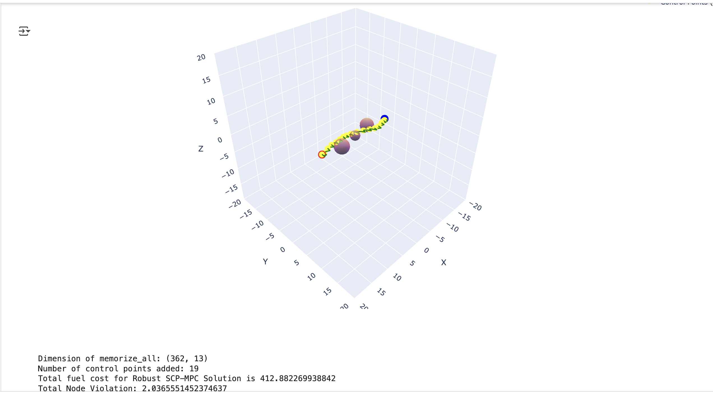

# Robust-SCP-for-Quadrotor-Obstacle-Avoidance and Controller Design-In-The-Presence-of-Wind

**Robust Sequential Convex Programming (SCP) for Quadrotor Obstacle Avoidance**

This is an ongoing project, and more work will be added!

In this project, our goal is to apply and compare various robustification techniques to a Sequential Convex Programming (SCP) framework for quadrotor obstacle avoidance. SCP works by creating convex subproblems from a non-convex problem—in our case, 3D quadrotor obstacle avoidance. This is achieved by linearizing the non-convexities and approximating them into convex subproblems, which are then solved iteratively within a trust region.

We will incorporate methods such as MPC, LQR, Simulink-based simulations, PID control, WARC, convex halfplanes, and funnel synthesis to robustify SCP against wind disturbances, which the SCP framework does not naturally account for.

You can find the code for the Obstacle Avoidance SCP algorithm (A significant portion is currently censored as this is unpublished work. For access to the full code, feel free to email me).

[KutayDemiralay_Quadrotor_Obstacle_Avoidance_SimulinkData_Censored.ipynb](./KutayDemiralay_Quadrotor_Obstacle_Avoidance_SimulinkData_Censored.ipynb)


### Performance of SCP Code Without Wind

Below is how the SCP code performs without wind:


**Figure 1:** As you can see, the node violation score is 0.0, meaning none of the nodes violate the obstacles in the route.

### Performance of SCP Code With Wind

However, when we add a constant wind force that the algorithm's dynamics are not aware of, the wind drags the drone off course, causing it to hit obstacles and drift away from our desired trajectory.


**Figure 2:** As you can see, the node violation score is around 339.72, meaning some of the nodes violate the obstacles in the route.


### Adding LQR-Style Feedback Tracking Controller

To handle wind disturbances, we first implement a simple **LQR-based tracking controller**. This controller applies feedback at each step to bring the drone back toward the SCP-generated nominal trajectory.

---

## 💡 LQR Feedback Control for Trajectory Tracking

We consider a linearized discrete-time system:

```
x_{k+1} = A x_k + B u_k
```

The Linear Quadratic Regulator (LQR) computes an optimal control law that minimizes the cost:

```
J = ∑ (x_kᵀ Q x_k + u_kᵀ R u_k)
```

The optimal feedback control is:

```
u_k = -K x_k
```

Or, in **trajectory tracking form** (used in this project):

```
u_k = u_ref,k - K (x_k - x_ref,k)
```

---

###  Riccati Equation and Gain Matrix

To compute `K`, we solve the Discrete-time Algebraic Riccati Equation (DARE):

```
P = Aᵀ P A - Aᵀ P B (Bᵀ P B + R)⁻¹ Bᵀ P A + Q
```

Here, `P` is the **cost-to-go matrix** — it reflects how costly it is to be in a given state.  
It's a smarter, dynamics-aware version of `Q`.

Then, the optimal feedback gain matrix is:

```
K = (Bᵀ P B + R)⁻¹ Bᵀ P A
```

This balances:
- **State tracking error** (`Q`)
- **Control effort** (`R`)

---

We compute `K` at each timestep using time-varying linearizations around the SCP trajectory:

```python
from scipy.linalg import solve_discrete_are

P = solve_discrete_are(A, B, Q_lqr, R_lqr)
K = np.linalg.inv(B.T @ P @ B + R_lqr) @ (B.T @ P @ A)
K_seq.append(K)
```

---


**Figure 3:** With aggressive tracking cost, LQR can closely follow the nominal trajectory even under wind disturbance.  
However, **since LQR has no knowledge of obstacle constraints**, it may result in **significant obstacle violations**.  
To address this, we need a **more robust and constraint-aware approach**, such as an **MPC-style SCP** method.


### Adding an MPC-Style Approach

To address challenges in trajectory optimization under disturbances such as wind, we have introduced an MPC-style approach to the Sequential Convex Programming (SCP) code. In this approach, the remaining trajectory is recalculated at each node, making the algorithm more responsive and adaptive to disturbances.


**Figure 4:** The node violation score is now 0.0 despite the presence of strong wind. However, the fuel cost has increased to 351.65, which is higher than in the case without wind. This indicates that while the trajectory is robust, it is not optimal in terms of fuel efficiency.


### Wind-Adaptive Residual Correction (WARC) technique:
To add lower-level robustness underneath the MPC of my quadcopter SCP algorithm, I use a novel technique to figure out the effect of wind from the previous node step.

#### Method:
1. **Wind Effect Estimation**:
   - After applying the control inputs calculated in the previous time step, I check where the drone ends up at the current node (using sensor data).
   - I compare this actual position (under wind) with where it would have been without wind. The deviation provides the impact of wind at that step.

2. **Wind Slope Calculation**:
   - By calculating the derivative (slope) of the displacement caused by the wind, I derive a correction factor to account for the wind disturbance.
   - This wind slope is added into the First-Order Hold (FOH) discretized matrices:
     \[
     x_{k+1} = A_k x_k + B_k u_k + B^+_k u_{k+1} + z_k
     \]
     where \( z_k \) (in the code, `z_bar`) represents the nonlinear residual, which accounts for the difference between the actual nonlinear system behavior and the linearized dynamics.

3. **Modification of `z_bar`**:
   - I modify `z_bar` to account for the wind's effect on the system. For the next time step, I use the wind effect from the previous step, assuming similar conditions in the upcoming step. 
   - This adjustment helps reduce drift caused by the wind without modifying the quadcopter's dynamics directly.

4. **MPC Integration**:
   - The wind information is incorporated into each MPC step, allowing the quadcopter to adjust its trajectory in real time.
   - This technique continuously corrects the trajectory using wind data while the main SCP algorithm operates as usual.

5. **Convex Half-space Integration**:
   -To discourage the quadcopter from taking large deviations or wide turns, convex half-space are defined along the reference trajectory and added as soft constraints. These constraints penalize the drone for straying too far from the desired path, increasing the cost in the optimization problem. As a result, the optimizer naturally favors shorter, more direct routes, leading to reduced fuel consumption.

   


**Figure 5:** The node violation score remains 0.0 despite the presence of strong wind. The fuel cost has now decreased to 343.01 from 351.65, achieved by adding the Wind-Adaptive Residual Correction (WARC) technique as a lower-level robustness layer beneath the existing robustifying MPC framework.


**Figure 6:** Four convex half-spaces visualized, guiding the drone to stay close to its central straight-line trajectory and discouraging large deviations.

### **Tracking-Style Approach**  

The previous approach was ineffective as it resulted in excessive fuel consumption. In this new approach, we first solve the entire path using **Sequential Convex Programming (SCP)** once. Then, in a second iteration, for each control node in the original trajectory, we solve a new trajectory segment starting from the **current control node** to the **next control node** in the original path. This iterative process continues until the trajectory reaches the final endpoint at **(10, 0, 0)**.  

This method significantly reduces fuel costs compared to the previous approach by guiding the drone through the narrow passage between obstacles—similar to the zero-wind case where it finds the original shortest path. However, a small node violation is observed. This occurs because, while navigating through tight spaces, the drone gets much closer to the obstacles, making it more vulnerable to wind disturbances that could push it toward them.

  

**Figure 7:** Tracking path in the presence of wind. The new approach follows the original path more closely than the previous **MPC-SCP** method. This improves fuel efficiency but increases the risk of collisions, as the vehicle passes through tighter spaces. (The spikes illustrate the discrete effect of wind disturbances at each node)


### **Adding Safety Margin to tracking style approah**

The previous approach was ineffective as it resulted in good enough fuel consumption, but there was node violation because of tight space passing.  
To overcome this, I added **safety margin**, which is basically the max value the wind vector can take in any direction (max norm).

With this method, we never approach the obstacles closer than the safety margin, so even in the worst-case wind scenario, we cannot hit the obstacles.  
Yet, this technique kind of lengthens the path slightly, but it is still much shorter than previous conservative techniques.

  

**Figure 8:** Safety margin added to tracking-style approach — drone still tries to fit through tight spaces, but preserves a safe distance from obstacles, making it harder to hit them even under wind (The spikes illustrate the discrete effect of wind disturbances at each node)


### Future Work

We assumed that wind remains constant, but in reality, wind conditions fluctuate. As a result, the wind effect from previous data may not perfectly match the wind effect at the current node. Future work will involve developing a technique, potentially building upon certain wind assumptions, to mathematically justify that a modified version of Wind-Adaptive Residual Correction (WARC) will consistently improve robustness under specific conditions.


**Figure 8:** An illustration of the wind assumption, showing a conceptual approach for calculating the maximum allowable wind disturbance the system can handle.

### Funnel Synthesis for Robust Trajectory Tracking

Another approach we explore is **funnel synthesis**, inspired by  
_Optimization-based Constrained Funnel Synthesis for Systems with Lipschitz Nonlinearities via Numerical Optimal Control_  
by **Taewan Kim**.

The goal is to design **time-varying ellipsoidal tubes** (funnels) around a nominal trajectory that keep a **nonlinear system safe and robust** under bounded disturbances, while satisfying both **state and control constraints**.

We use **Lyapunov functions** to ensure:

- **Invariance**: all trajectories starting inside the funnel remain inside the funnel, even under bounded disturbances.
- **Safety**: by construction, the system avoids obstacles and respects input/state bounds.

This is formulated as a **Differential Linear Matrix Inequality (DLMI)** problem.

To make the problem tractable, the DLMI is converted into a **Semidefinite Program (SDP)** using:

- Multiple shooting
- Optimal control discretization techniques

---


**Figure 9:** Illustration of ellipsoidal funnels constructed at each node along the SCP-generated nominal trajectory (without wind). These funnels define robust tracking tubes that can tolerate disturbances while remaining within safe, constraint-satisfying regions.


### Simulink Controller Design

An autonomous vehicle system has two key components: the first involves finding the optimal trajectory, and the second is designing a controller to ensure the vehicle follows that trajectory.

For this project, I designed a controller based on the principles outlined in "Quadcopter Modeling and Simulation Based on Parrot Minidrone." I simplified and adapted the model, tuned the PID controllers and other control parameters, and tailored the design to my specific quadcopter case, added wind distubance,  added proper referance commands. By integrating the commands from my SCP (Sequential Convex Programming) algorithm (same commands from Figure 1) , I developed a controller that effectively follows the optimized trajectory while accounting for the specific needs of my quadcopter.


The entire system was simulated using Simulink 3D Animation for visualization.

You can find the Simulink Model for the Quadcopter Obstalce Avoidance :

[QuadcopterObstacleAvoidanceSimulinkModel.slx](./QuadcopterObstacleAvoidanceSimulinkModel.slx)


**Figure 10:** . Simulink Main Block Diagram for Obstacle Avoidance Quadcopter Design


**Figure 11:** . Simulink Controller 3D Animation GIF (Same Scenario as Figure 1)


**Figure 11:** . Simulink Controller 3D Animation GIF: No Wind-Resisting PID Controller in Lateral Motion (Same Scenario as Figure 2)


### Real-world hardware tracking test using precomputed references

On real hardware — a drone with similar physical properties to the one used in simulation — I will send the reference positions computed offline to our lab's drone. I will log the control inputs required for the drone to track that trajectory, in order to verify two things: (1) whether the drone can accurately follow the planned path, and (2) whether the control inputs observed in real life match those computed by the Python model. If not, I will quantify the deviation.


